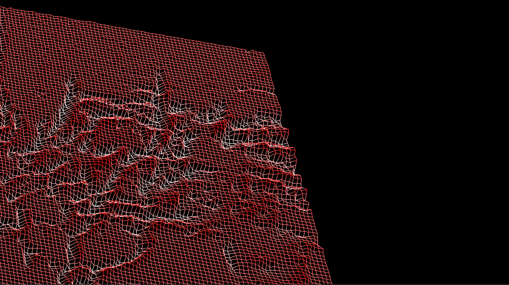

# fdf
42 fdf-project
FDF or "fils de fer" of wireframe.
c program that takes in a map of height data and displays it on a window as wireframe.
- p: perspective mode
- o: orthographic mode
- arrows: move

